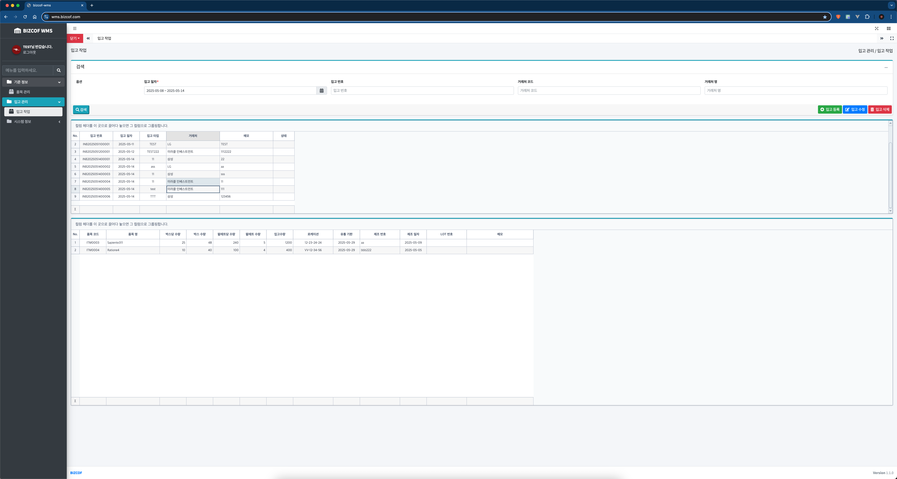
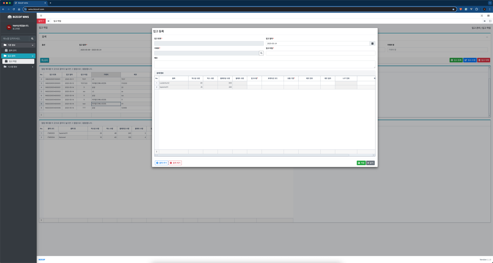
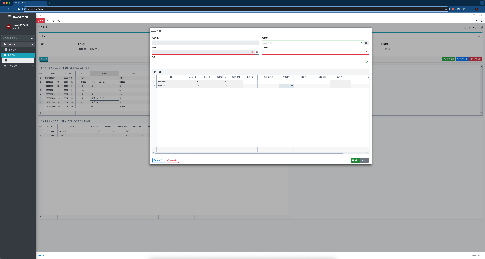
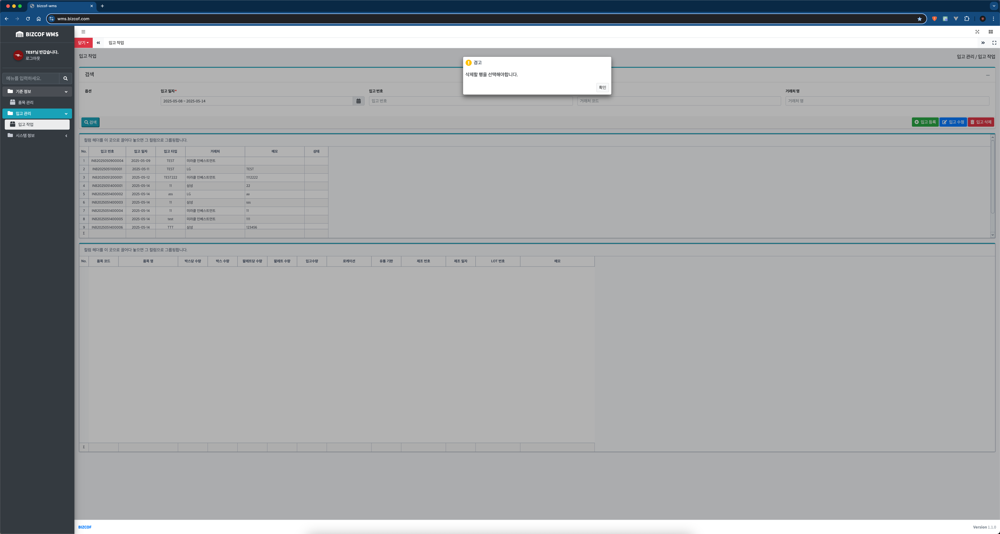
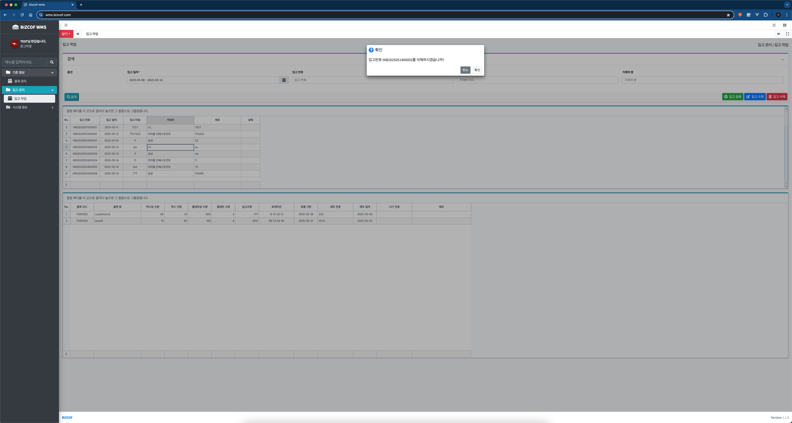

# 📦 Bizcof WMS

`Bizcof WMS`는 실시간 입출고 및 재고 관리가 필요한 제조/물류 기업을 위한 **창고 관리 시스템(WMS)**입니다.  
**Kafka, Redis, RealGrid2** 등을 활용해 대량 트랜잭션 처리와 고가용성을 실무 수준으로 설계했습니다.

> 본 프로젝트는 설계부터 개발, 배포까지 전 과정을 직접 수행한 개인 프로젝트입니다.

---

## ✨ 주요 기능

- **입고/출고 관리**: 실시간 데이터 기반의 입출고 처리
- **재고 관리**: Redis + Kafka 기반 실시간 재고 반영
- **로케이션 관리**: 창고 내 위치 정보 트래킹
- **거래처/품목 관리**: 마스터 데이터 등록 및 검색
- **이력 조회**: 작업 히스토리 실시간 추적

---

## 🌐 URL
- **운영 사이트:**  
  [https://wms.bizcof.com](https://wms.bizcof.com)

- **백엔드 (API 서버 - Swagger 문서):**  
  [https://wms.bizcof.com/swagger-ui/index.html](https://wms.bizcof.com/swagger-ui/index.html)

---

## 📁 프로젝트 구조

``` text
bizcof
├── bizcof-wms-app         # 실행 애플리케이션 (Spring Boot)
├── bizcof-wms-api         # 도메인 비즈니스 로직 (도메인 중심 모듈)
├── bizcof-common-core     # 공통 유틸, 공통 응답/예외 처리, Config 등
├── build.gradle           # 루트 Gradle 설정
└── settings.gradle        # 멀티모듈 프로젝트 설정

```

## 📌 Languages
- Java 17

## 📦 Framework
- Spring Boot 3.4
- Spring Security
- Spring Data JPA
- Spring for Apache Kafka 3.4.4
- Redisson (for Redis 8.0.0) 

## 🖥️ Environment
- Ubuntu 20.04.6 LTS
- Nginx
- Git
- Gradle
- Kafka (Kraft)
- Redis (Standalone)

## 🚀 CI/CD
- GitLab (GitLab Runner)

## 🗄️ Database
- MariaDB 10.3

## 🧰 Tools
- IntelliJ IDEA

## 🔧 ETC
- Thymeleaf (템플릿 엔진)
- AdminLTE (UI 템플릿)
- RealGrid2 (웹 그리드)
- Lombok
- SLF4J + Logback


## 🖼️ 실제 화면

### 로그인 화면 


### 품목 관리


### 품목 관리 - 품목 등록(모달)


### 품목 관리 - 품목 등록 - 거래처 조회(모달)


### 입고 관리


### 입고 관리 - 입고 등록(모달)

#### 유효성 검사

#### 입고 삭제



### 시스템 정보 - 메뉴 관리


### 시스템 정보 - 사용자 관리

